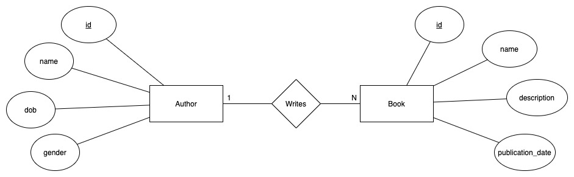

# Springboot Mybatis

这部分演示了：

- 数据库的设计和数据插入

- 如何在springboot中整合使用mybatis

- mybatis中基础的CRUD, 通过resultMap解决字段和属性名不一致的问题, 多对一关系映射
- RESTful 风格接口的设计和实现

为了简化代码结构，未能实现的：

- 由于代码层次比较简单，业务比较基础，因此未实现Service层
- 接口接收数据的校验和数据库可能产生的异常处理未实现(比如传递重复的id等)
- RestController返回值过于原始

